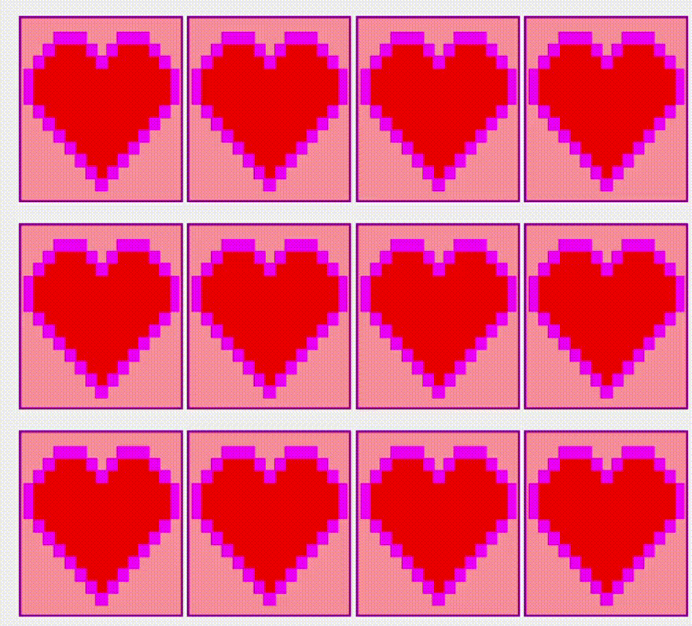

# DessertMemory
Memory Game with Delicious Desserts
Collaboration with my daughter who drew these lovelies in Procreate.  Created in Visual Studio C# .Net.  

To Run: Download Memory.exe which is in the Bin>Release Folder.

To Do: It would be fun to add the option of the user entering their own pictures.  It would also be fun to have the option of the timer working backwards so that you must complete the game within a certain time.

